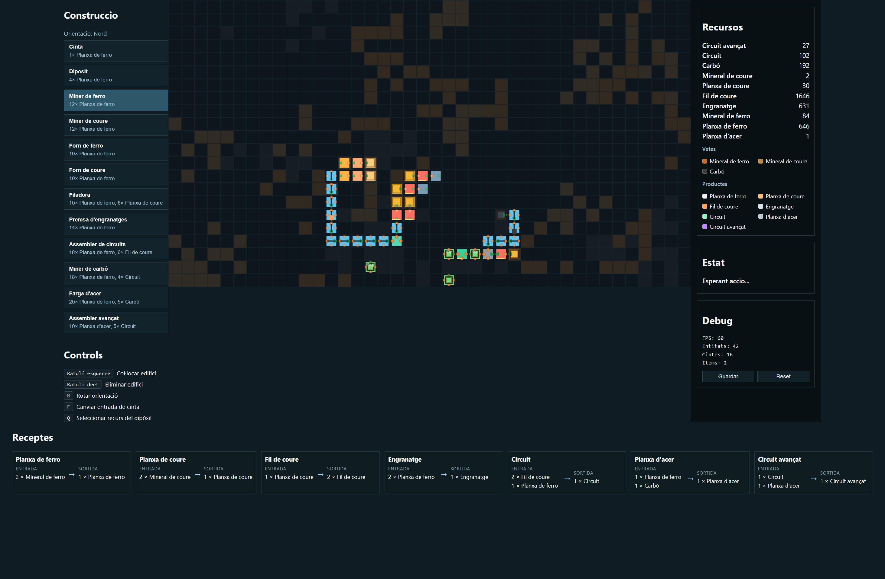

# Joc Auto 2D (HTML/JS)


Simulador 2D d'automatització tipus Satisfactory construït amb HTML, CSS i JavaScript modular. Permet extraure recursos de vetes, transportar-los amb cintes i processar-los en màquines per obtenir productes més avançats.

## Taula de continguts
1. [Arquitectura i tecnologia](#arquitectura-i-tecnologia)
2. [Instal·lació i execució](#instal·lació-i-execució)
3. [Controls i HUD](#controls-i-hud)
4. [Flux de joc](#flux-de-joc)
5. [Receptes i edificis](#receptes-i-edificis)
6. [Persistència](#persistència)
7. [Estructura del projecte](#estructura-del-projecte)

## Arquitectura i tecnologia
- **Client-only**: tot el joc resideix sota `public/` i es serveix com a pàgina web estàtica (`index.html` + `src/`).
- **Mòduls ES**: la lògica està dividida en `core/` (motor i estat), `systems/`, `entities/`, `ui/` i `data/`.
- **Canvas 2D**: renderitzat manual de la graella, entitats i recursos (ports d’entrada/sortida) per tenir control total sobre l’aspecte.
- **Event Bus**: `WorldState` exposa `on/off/emit` per coordinar systems (input, construcció, recursos, persistència).
- **Autoguardats**: `PersistenceSystem` serialitza inventari, entitats i vetes a `localStorage`.

## Instal·lació i execució
1. Clona o descarrega el repo en local.
2. Obre `public/index.html` directament al navegador (no cal servidor).
   - Per evitar restriccions de mòduls en alguns navegadors pots llançar un servidor estàtic (`npx serve public`, `python -m http.server`, etc.).

## Controls i HUD
- **Ratolí**:
  - Cursor: mostra un reticle amb color segons la col·locació (blau = apuntant, verd = vàlid, vermell = invàlid).
  - Tooltip: indica la veta detectada i l’edifici sota el cursor.
  - Clic esquerre: col·loca l’edifici seleccionat (si el fantasma és verd).
  - Clic dret: elimina l’estructura de la cel·la (el panell d’estat confirma l’acció o avisa si no hi havia res).
- **Tecles**:
- `R`: rota la sortida de l’edifici seleccionat (Nord → Est → Sud → Oest).
- `F`: (només cintes) canvia la direcció d'entrada preferida; les cintes accepten automàticament entrades frontal i laterals, però amb `F` pots forçar quin port es destaca.
- `U`: millora l’edifici que tens sota el cursor (si la millora està disponible i tens recursos).
- `Q`: mentre apuntes a un `Dipòsit`, cicla quin recurs de l’inventari vols que expulsi per la sortida (cal que hi hagi stock).
- `I`: inspecciona la casella sota el cursor i mostra un resum (veta, entitat, configuració) al panell d’estat.

### HUD (panell dret)
1. **Recursos**: inventari actual i llegenda de vetes/productes.
2. **Construcció**: selector d’edificis amb el cost detallat; mostra l’orientació actual.
3. **Receptes**: resum d’entrades/sortides de totes les receptes disponibles.
4. **Estat**: missatges d’èxit/error per a construccions i destruccions.
5. **Debug**: estadístiques (FPS, entitats, cintes, ítems) + botons `Guardar` i `Reset`.

## Flux de joc
1. **Explora vetes**: el mapa genera clústers pseudoaleatoris de ferro i coure; identifica’ls amb el tooltip o la capa translúcida.
2. **Extreu**: col·loca un `Miner de ferro/coure` exactament sobre la veta corresponent (el reticle serà vermell si no coincideix).
3. **Transporta**: crea cintes (`Cinta`) i gira-les amb `R` per connectar miner → màquina. Les cintes mostren entrada (cercles taronges) i sortida (fletxes verdes).
4. **Processa**:
   - `Forn de ferro`/`Forn de coure` produeixen mineral a planxes.
   - `Filadora` converteix planxes de coure en fil.
   - `Premsa d'engranatges` usa planxes de ferro per produir engranatges.
   - `Assembler de circuits` consumeix fil de coure + planxes de ferro (recorda connectar-li dues cintes: una al port oest i l'altra a qualsevol dels ports lateral) i diposita els circuits directament a l'inventari.
5. **Recull**: connecta la sortida de cada màquina a una cinta i finalitza-la en un `Diposit` o en una altra màquina. Els dipòsits accepten recursos pels quatre costats, els envien a l’inventari i, si els configures amb `Q`, poden tornar a expel·lir el recurs seleccionat cap a la seva cara frontal.
6. **Gestiona recursos**: vigila el panell de recursos per assegurar-te que pots pagar el cost de nous edificis (els botons indiquen el cost exacte).

## Milestones i Tier 2
1. **Tier 1 (inici)**: Totes les vetes disponibles són de ferro i coure. L’objectiu és construir la cadena fins a obtenir circuits (`Assembler de circuits`).
2. **Milestone – 100 circuits**: quan l’inventari acumula 100 `Circuit`, el `ProgressionSystem` activa el **Tier 2**:
   - Es generen noves vetes de **Carbó** sobre el mapa.
   - Es desbloquegen nous edificis (Miner de carbó, Farga d’acer i Assembler avançat).
   - El panell de construcció mostra els edificis de Tier 2 i, si encara no els tens disponibles, indica “Necessita Tier 2�.
3. **Tier 2**: Pots explotar carbó per combinar-lo amb planxes de ferro i obtenir `Planxa d'acer`, imprescindible per fabricar `Circuit avançat` i, per tant, per progressar cap al següent tier.
4. **Upgrades**: amb la tecla `U` pots promocionar miners i forns (cost = 2x cost base + 5 circuits avançats), cintes (1 planxa d'acer + 1 circuit avançat) i qualsevol edifici de Tier 2 (2x cost base + 10 circuits avançats). Les versions nivell 2 processen més ràpid o transporten més depressa, i el joc mostra una franja daurada per als edificis de Tier 2 i un distintiu verd "2" quan estan millorats.

## Tiers

tier1


tier2

## Receptes i edificis
| Edifici | Tier | Cost | Funció | Entrades | Sortides |
|---------|------|------|--------|----------|----------|
| Cinta | 1 | 1× Planxa de ferro | Mou ítems d'una cel·la a l'altra | 1 direcció d'entrada | 1 direcció de sortida |
| Diposit | 1 | 4× Planxes de ferro | Emmagatzema recursos al teu inventari | Qualsevol direcció | — |
| Miner de ferro | 1 | 12× Planxes de ferro | Extreu mineral de ferro | — | Mineral de ferro |
| Miner de coure | 1 | 12× Planxes de ferro | Extreu mineral de coure | — | Mineral de coure |
| Forn de ferro | 1 | 10× Planxes de ferro | Converteix mineral de ferro en planxes | 2× Mineral de ferro | 1× Planxa de ferro (per cinta) |
| Forn de coure | 1 | 10× Planxes de ferro | Converteix mineral de coure en planxes | 2× Mineral de coure | 1× Planxa de coure (per cinta) |
| Filadora | 1 | 10× Planxes de ferro, 6× Planxes de coure | Produeix fil de coure | 1× Planxa de coure | 2× Fil de coure (per cinta) |
| Premsa d'engranatges | 1 | 14× Planxes de ferro | Fa engranatges | 2× Planxes de ferro | 1× Engranatge (per cinta) |
| Assembler de circuits | 1 | 18× Planxes de ferro, 6× Fil de coure | Fa circuits | 2× Fil de coure, 1× Planxa de ferro | 1× Circuit (inventari) |
| Miner de carbó | 2 | 18× Planxes de ferro, 4× Circuit | Extreu carbó | Veta de carbó | Carbó |
| Farga d'acer | 2 | 20× Planxes de ferro, 5× Carbó | Fusiona ferro + carbó | 1× Planxa de ferro, 1× Carbó | 1× Planxa d'acer (per cinta) |
| Assembler avançat | 2 | 10× Planxa d'acer, 5× Circuit | Fa circuits avançats | 1× Planxa d'acer, 1× Circuit | 1× Circuit avançat (inventari) |

> Consulta el panell de Receptes per a detalls visualment més compactes.

## Persistència
- **Autoguardat**: cada 30 segons (configurable a `PersistenceSystem`) serialitza inventari, entitats, vetes i el seed a `localStorage`.
- **Botons**:
  - `Guardar`: força un guardat immediat.
  - `Reset`: buida el `localStorage` i reinicia el món amb noves vetes.

## Estructura del projecte
```
public/
├─ index.html            � HTML principal + HUD
├─ styles/
│  └─ main.css          � Estils del joc i HUD
└─ src/
   ├─ main.js           � Punt d’entrada
   ├─ core/             � Engine, WorldState, Storage
   ├─ systems/          � Input, Build, Conveyor, Resource, Persistence
   ├─ entities/         � BaseEntity, Cinta, Miner, etc.
   ├─ ui/               � Panells HUD (Recursos, Construcció, Receptes, etc.)
   └─ data/             � Buildables, Receptes, vetes
```

## Roadmap suggerit
- Afegir més tipus de recursos/receptes (acer, oli, circuits avançats).
- Implementar upgrades (cintes més ràpides, miners de nivell 2).
- Guardar múltiples partides i exportar/importar en fitxers JSON.
- Afegir objectius o milestones per guiar el jugador.

